# React Intermediário - Digital Innovation One

Este código foi produzido com o intuito de prover exemplos ao [curso da Digital Innovation One](https://web.digitalinnovation.one/course/desenvolvimento-de-aplicacoes-para-internet-com-reactjs/learning/c6a6c9e3-c419-4443-9191-b3bf851d1ce4).
This project was bootstrapped with [Create React App](https://github.com/facebook/create-react-app).

## Setup

1. Tenha o [Node.js](https://nodejs.org/en/download/) instalado em seu computador e clone este projeto. Também instale o [Yarn](https://yarnpkg.com/lang/pt-br/docs/install) em sua máquina.
2. Na pasta raiz, instale todas as dependencias do projeto com o comando `yarn`.

## Comandos

### `yarn start`

Roda o app em modo de desenvolvimento.<br>
Abra [http://localhost:3000](http://localhost:3000) para ver os exemplos da aula no browser.

### `yarn test`

Roda todos os testes criados.<br>
Veja a documentação, na seção [running tests](https://facebook.github.io/create-react-app/docs/running-tests) para mais informações.

### `yarn build`

Empacota o projeto em um bundle de produção na pasta `build`.<br>
Veja mais na seção [deployment](https://facebook.github.io/create-react-app/docs/deployment) da documentacao para saber mais como efetuar um deploy correto de sua aplicação.

# Desenvolvimento de aplicações para internet com ReactJS

## Css componentes e elementos 
Como estilizar ? 
### inline 
Dentro do arquivo jsx 
- Pros  : Pratico , direta , ajuste  rapido  e testes de estilo 
- contra - manutenção 
```
import React from 'react';

// 1. Como estilizar uma lista usando estilos inline.

const listaEstilizada = {
  marginTop: '10px',
  border: '1px solid blue',
  padding: '25px'
};
```
- Os estilos pela tag style são feitos por um JSON onde o CSS é escrito CamelCase.
### classes 
- pros Modularizada define-se classes pelo atributo classname 
- contra dificil manutencao 
- pouca flexibilidade 
- conflitos de nomes (solução: Design patterns)
- arquivo ClassName.css
```
.div-style {
  display: flex; 
  flex-direction: column; 
  justify-content: space-around;
  margin-right: 20px;
}
``` 
e depois importa-se no codigo , usamos className e não class para poder importa-lo no react 
```
import './ClassName.css'
function Hello(){
    return <div className="div-style"> Ola mundo </div>
}
```
###  Css no JS 
- npm install --save styled-components
- A biblioteca styled components é exemplo de uma biblioteca em que se pode usar CSS in JS.
- pros:  manutenção facilidade para remover css estilos dinamicos performance injeção automatica de prefixos vendor 
```
const DivStyle = styled.div`
  color:blue;
  background: url('${props=> props.imageUrl}');
`; 
function Hello(){
    const url = 'https://exemplo'
    return <DivStyle imageUrl={url}> Olá </DivStyle>
}
``` 
## Stateful vs StateLess 
- A nomenclatura foi atualaizada : 
- Class components
- Function Components 
- Com hooks estados são manipuláveis em function components (Stateless com Hooks )
- Dessa forma temos um código compatco com a vantagem de poder manipular estaods 
### Stateful 
- Stateful usa estados toda vez que trabalhamos com estados , destruimos uma copia anterior e trabalhamos com uma nova cópia do estado 
- Supondo um estado chamado shoe, setado inicialmente como ‘tênis’, podemos trocar o seu estado, por ex, usando this.setState({ shoe: 'sapatenis’ }).

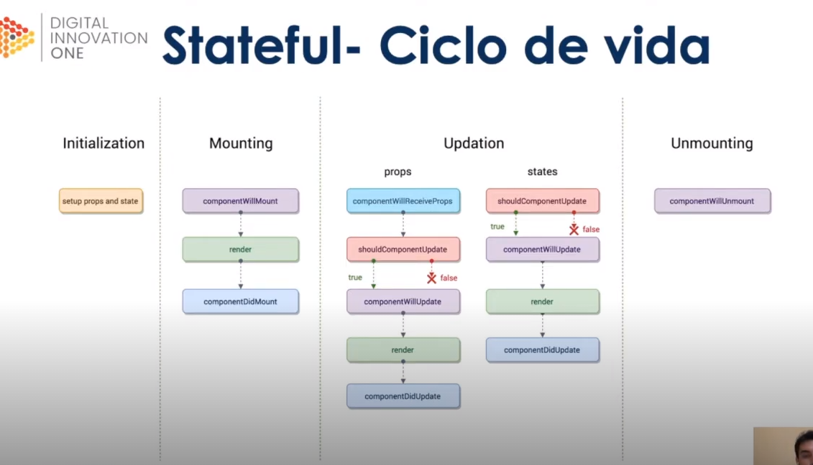
- ..\aplicacoes_internet_reactjs\src\aula-1\parte-2\TodoListStatefull.jsx
### Stateless 
- stateless não usa estados
- Podemos setar o estado inicial de um componente stateless com props.
- Não possui gerenciamento de estados no componente
- contruidos usando funções em js 
- ..\aplicacoes_internet_reactjs\src\aula-1\parte-2\TodoListStateless.jsx
### Stateless com Hooks 
A partir de 2018 , podemos fazer um "stateless com estados" usando o hook useState 
- ..\aplicacoes_internet_reactjs\src\aula-1\parte-2\TodoListFunctional.jsx
## Formulários
Mantem um estado interno 
- Em html 
``` 
<input>,
 <textarea> e 
 <select> 
 ```
 tem um estado interno aceitando atributo value 
- podemos mudar esse valor usando o atributo onChange 
- em react podemos controlar o estado ( O DOM tem seu proprio estado e o react tem seu proprio estado ) 
- state 
- set state 
## Componente controlado 
- O recomendado no react é fazer componentes controlados 

## Componente não controlado 
- pega o estado do dom 
- o react observa estes estados através de uma referencia 
- a tag input é read-only (essa tag a gente nao consegue fazer com componente controlado, só com não controlado)
## bibliotecas 
- forms no react são verbosos 
- é possível usar algumas biblios : 
- formik 
- Redux-forms 
# Flux 
- Arquitetura criada pelo Fb para comunicação entre componentes 
- falta de sincronização entre os componentes de notificação no facebook 
- haviam patterns para trafegar dados em aplicações web mas nada muito promissor 
-  Fb criou o flux e resolveu o problema
- padrão para trafego de dados unidirecional 
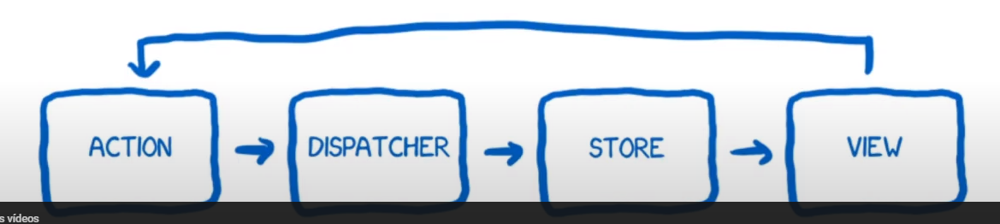

## Action  
- Formata a mensagem a ser enviada (telégrafo)
 ## Dispatcher
 - Sabe todos os callbacks para diferentes Stores  (telefonista)
 ## Store
 É um gerente supercontrolador, guarda a informação e todas as alterações tem que ser feitas por ele mesmo mais ninguem 
 ## View 
Gerente intermediario (middleware) recebe as notificações da store e passa os dados para as visões abaixo dela 
## Arquitetura Flux
Diversas implementações 
- Redux ( mais popular)
- Reflux
- Mobx 
- Vuex (Baseado em Redux e Elm)
- NgRx/store (badeada em REdux e RxJs)
- FB disponibiliza as libs para que você construa sua própria flux 
- não existe uma implementação padrão do flux 
- servem para comunicação entre componentes 
- centralizam a informação 
- One way data flow 
- Ideal é usar as stores para dados que vão ser compartilhados entre componentes, não todos os dados 
# O que é Redux 
- Criado por Abramov e Clark em 2015 
- Redux é uma  implementação de flux 
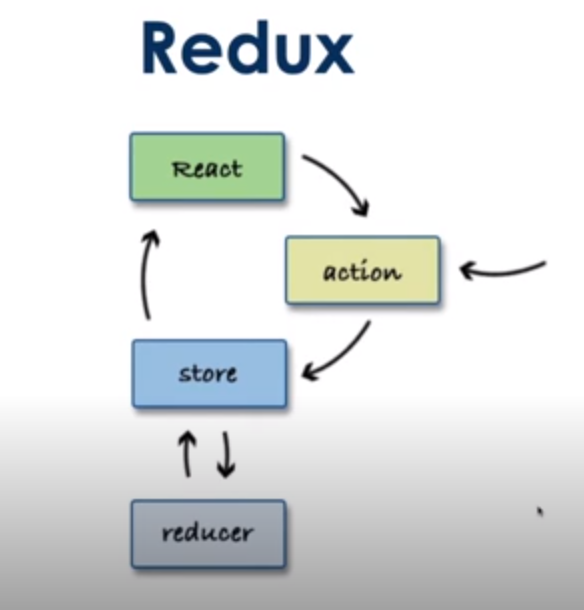
-Redux tem  3 princípios : 
- Single source of Thuth - uma única store 
- State é read-only 
- mudanças são feitas por funções puras ( estado imutável ) 

- Redux nao tem dispatcher 
- A camada de view eh chamada de react
- Reducer 
## actions 
- são como as do flux 
- apensa retornam um objeto de action formatado 
- As actions formatam a mensagem a ser enviada para o dispatcher.
## Store 
- unica store
- cuida de toda árvore de estados 
- reducers cuidam de descobrir qual estado muda 
## reducers 
- simplifica e divide o tarbalho da store
- se conecta ao root reducer que divide os estados em pequenos reducers para descobrir como lidar com eese estado 
- estados imutáveis 
## Views 
- Em react adiciona na camada de View 3 novos conceitos para conectar a View a Store 
- Provider wrapper da arvore de components, torna mais facil os componentes filhos se conectarem usando o connect 
- Connect  função no react redux se o componente deseja pegar os updates do estado se envolve na função connect 
- Selector função que escrevemos que definem quais os estados do redux que queremos passar 
No root component:
O Provider recebe como atributo a store criada, usando-a onde ela for necessária para a aplicação.
## Aula 2.3 
Instalar o redux dev tools 
- https://chrome.google.com/webstore/detail/redux-devtools/lmhkpmbekcpmknklioeibfkpmmfibljd?hl=pt-BR
- npm install react-redux
- npm install --save-dev redux-devtools
- usamos o redux dev tools e rodamos a aula 2 para ver que cada vez que o contador eh clicado vemos o estado anterior e o estado atual 
- criamos a pasta redux que tem o arquivo de actions  (mensagem enviada)

# Aula 3 
## Comunicação avançada entre aplicações 

## rest http com react 

Apis HTTP 
Servem para conectar um ou mais servidores http 
- get 
- post 
- delete 
- put 
- fetch api (nativamente) Jquery ajax 
- Axios (lib http muito usada com react)
## Fetch Api 
Alguns browsers ainda nao suportam (talvez melhor usar node fetch)
- nativa do browser 
- Oferece uma alternatuva ai XMLHttpRequest() e jQuery.ajax()
- suporte a service workers
- algumas diferenças 
- nao envia nem recebe cookies ( precisa definir a opção cedentials)
- nao rejeita o statudos do erro HTTP (nem 400 nem 500)
- ele está mostrando como montar os métodos HTTP para nossa api "cientistas" aula 3 . 
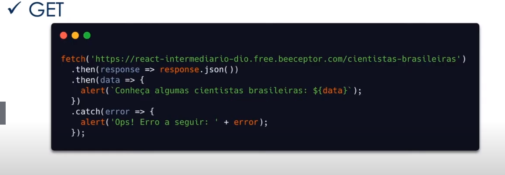
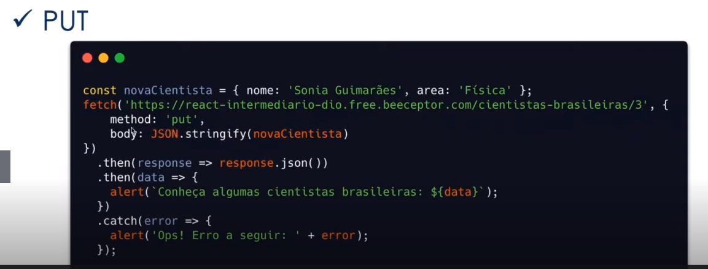
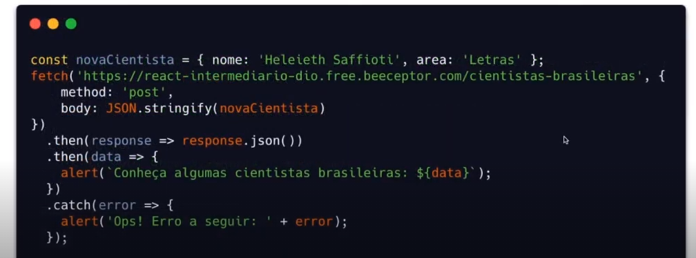
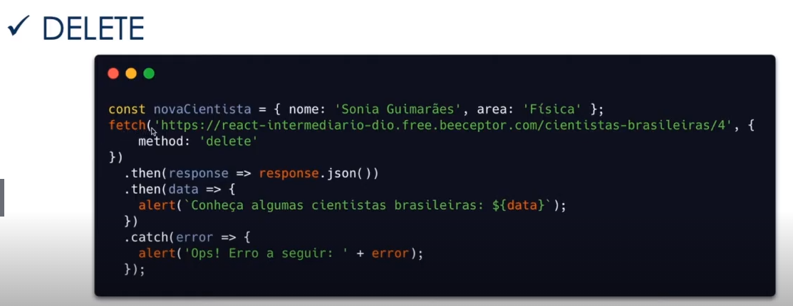


## Axios 
- Lib de HTTP API 
- Cross-Browser
- Pode monitorar o progresso de um request 
- melhor tratamento de erros 
- melhor teste 
- bem restrito ao pwa 
- npm add axios 
- métodos HTTP : 
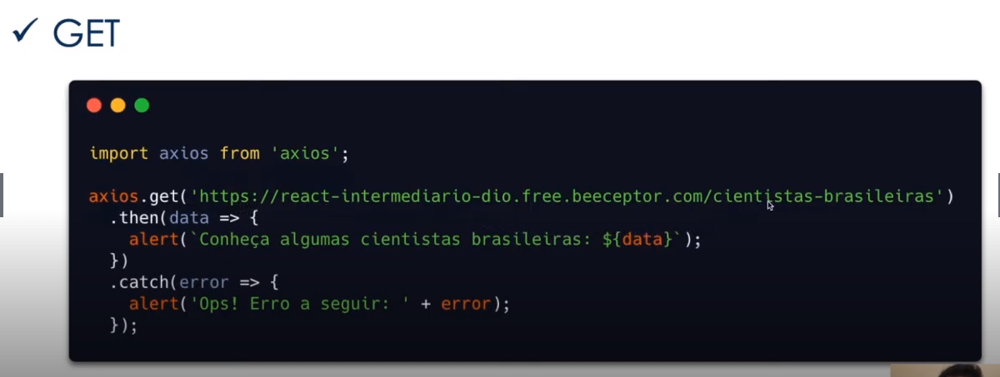
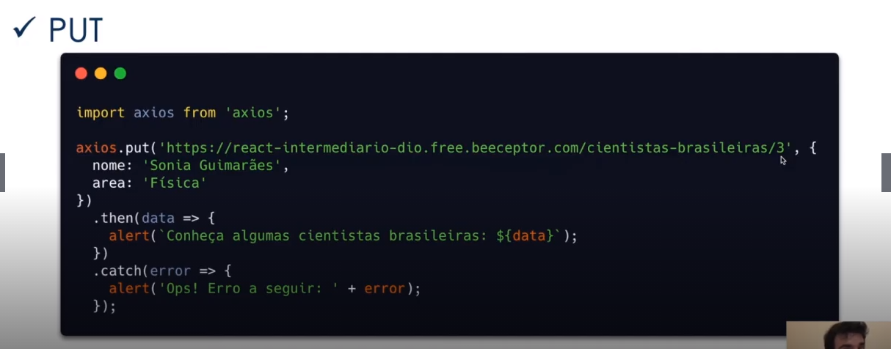
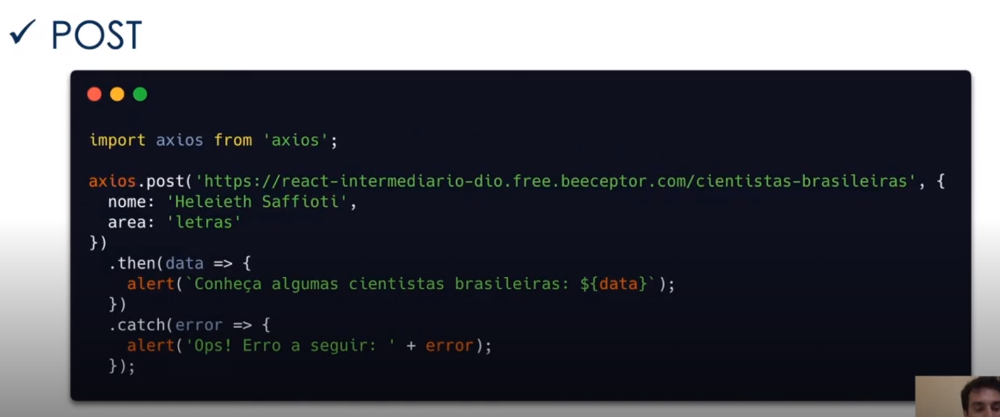
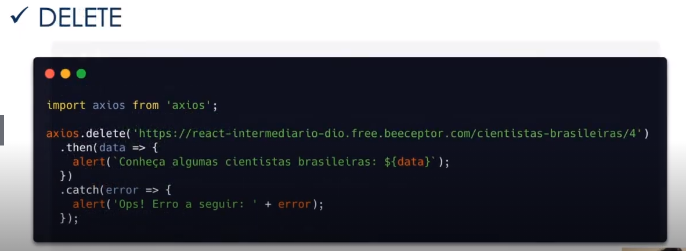


## Imutabilidade e Redux 


